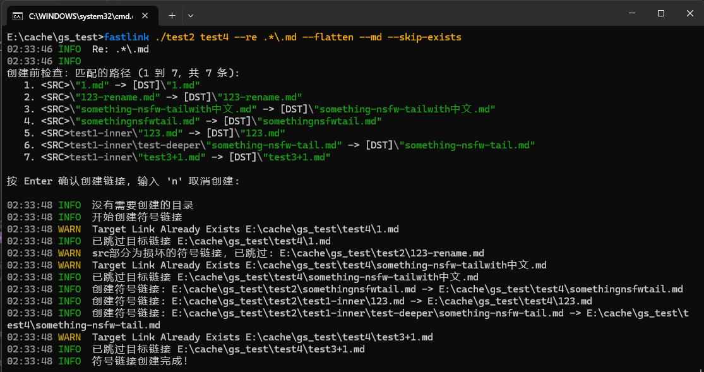

# fastLink
A tool to make symlink fastly and smartly, support regex  
一个智能且方便的符号链接创建工具，支持regex  

For Windows (at present)

如果你处于Windows的开发者模式，则不需要`sudo`或者`管理员权限`  
Do not need `sudo` or `administrator` if Developer Mode enabled.  

slim版不支持re、输出日志到文件等功能   
slim-version does not support Regex or save log to file or some other features.



## Usage (not up to date yet)
```cmd

Usage: fastlink.exe [OPTIONS] <SRC> [DST]

Arguments:
  <SRC>
          源文件/源目录路径，表示的是符号链接指向的路径(Point at who)。

  [DST]
          目标路径，可选，区分文件拓展名，表示的是要创建在什么位置(Where to create)。 为空则自动以<SRC>路径名称填充；当<SRC>为文件，[DST]为目录时，自动以<SRC>路径名称填充

Options:
  -c, --check
          高优先级参数, 切换为检查模式，添加后不会创建链接: 检查<SRC>属性，包含文件/目录/符号链接，以及符号链接损坏与否
          
          如果只给出<SRC>，则检查SRC，若同时传入DST，则检查DST.支持Re.

      --rm
          高优先级参数, 切换为删除模式，添加后不会创建链接: 若<SRC>是符号链接，则删除。
          
          如果只给出<SRC>，则删除SRC，若同时传入DST，则检查DST.支持Re.

  -k, --keep-extention
          *追加*<SRC>的文件拓展名到[DST]，不会去除/替换 保留拓展名之后可以通过对符号链接双击、运行等操作让系统使用默认应用打开或执行。
          
          src:".jpg", dst: ".jpg" -> dst: ".jpg"; src:".jpg", dst: ".temp" -> dst: ".jpg.temp"

      --make-dir
          自动创建不存在的目录
          
          [aliases: --md]

  -q, --quiet
          只输出warn与error level的日志

      --debug
          输出debug level的日志

      --regex <REGEX>
          对<SRC>内容应用正则表达式，匹配项将于[DST]相应创建。对于程序如何处理多层级的目录见only_dir参数
          
          注：若启用make_dir参数，则还会尝试对<SRC>的子目录以及更深层(默认最大4层)进行匹配并创建， 若要限制深度，使用--re-max-depth参数。
          
          注：匹配的路径不受--keep_extention参数影响。
          
          注：只会为最深层的目录创建符号链接，其他层次目录则会正常创建文件夹
          
          [aliases: --re]

      --re-max-depth <RE_MAX_DEPTH>
          限制regex匹配的最大深度，启用make_dir参数时，默认4层，否则为1层, 传入0表示没有层数限制. 该参数数值非负
          
          [aliases: --re-depth]

      --only-file
          只为文件创建符号链接，但仍然会创建目录
          
          [aliases: --F]

      --only-dir
          只为最深目录创建符号链接，其他目录则会创建文件夹，受re-depth参数约束
          
          程序将如何为目录创建符号链接？ e.g.1 给定src的子目录最深为5层，re-depth参数默认为4层，会为层级为4的目录创建符号链接， 1、2、3层只会创建文件夹
          
          e.g.2 给定src的子目录最深为3层，re-depth参数默认为4层，会为层级为3的目录创建符号链接， 1、2层只会创建文件夹
          
          [aliases: --D]

      --re-follow-links
          re匹配过程中，深入读取符号链接进行匹配
          
          [aliases: --follow-links, --follow-link]

      --re-no-check
          取消re匹配后，创建链接前的用户手动检查阶段
          
          [aliases: --no-check]

      --re-output-flatten
          对于re匹配的后所有内容，不按照原本目录（镜像）创建链接， 而是直接创建到[DST]中。 如果匹配的文件名有重复，则会拒绝创建并报错
          
          [aliases: --flatten]

      --overwrite-links
          覆盖同名已存在的符号链接，与--skip-exist-links互斥
          
          [aliases: --overwrite, --overwrite-link]

      --overwrite-broken-link
          --overwrite-links的较弱版本，但优先级高于--skip-exist-link，只覆盖损坏的符号链接. 默认为true, 暂不支持关闭
          
          [aliases: --overwrite-broken]

      --skip-exist-links
          针对[DST]，跳过同名已存在的符号链接，与--overwrite-links互斥
          
          [aliases: --skip-exist, --skip-exists, --skip-exist-link, --skip-exists-links]

      --skip-broken-src-links
          针对<SRC>，跳过损坏的符号链接. 默认为true, 暂不支持关闭
          
          [aliases: --skip-broken, --skip-broken-link, --skip-broken-links]

      --save-log <SAVE_LOG>
          在目标路径输出/保存/导出本次处理日志 若路径不存在，则将当前工作目录并重命名为fastlink-%y-%m-%d-%h-%m-%s.log

      --allow-broken-src
          允许使用损坏的符号链接作为src (开了也不行，想都别想)

  -h, --help
          Print help (see a summary with '-h')

  -V, --version
          Print version

```

## Example
```bash

    # 1. 在当前目录创建一个名为document.txt的符号链接（没有给出dst，直接用src文件名）
    fastlink some_where/document.txt

    # 2. 在当前目录创建一个名为img-link.jpg的符号链接
    # src为文件，使用dst作为链接名称，`-k`则自动从src获取拓展名追加到src
    fastlink image.jpg img-link -k

    # 3. dst有目录倾向, 在tmp目录下创建名为data.csv的符号链接
    # (目录倾向指的是路径以'\'或'/'结尾)
    fastlink data.csv tmp/

    # 4. 同上，--md将自动创建目录
    fastlink data.csv tmp/ --md

    # 5. 在当前目录的父目录创建名为data.csv的符号链接
    fastlink data.csv ../

    # 6. src为目录，dst有目录倾向，在backup中创建名为mydir的链接
    fastlink mydir/ backup/ --md

    # 7. 为./test-dir目录中所有满足.*\.txt正则表达式的路径（即所有txt文件） 创建链接到output目录中
    fastlink ./test-dir output --re .*\.txt 

    # 8. ./test-dir目录及其子目录或更深目录中所有文件 -> 镜像目录创建链接到output目录中
    fastlink ./test-dir output --re .* --only-file

    # 9. 将./test-dir目录及其子目录或更深目录中所有txt文件 -> 直接创建链接到output目录中，不包含原始目录结构（可包含对文件夹的符号链接）
    fastlink ./test-dir output --re .*\.txt --flatten

    # 10. 保存日志到指定文件
    fastlink document.txt --save-log my_log.log

    # 11. 保存日志到默认路径（fastlink-YY-MM-DD-HH-MM-SS.log）
    fastlink data.csv tmp/ --md --save-log=""


```

## 未来计划
- [ ] 支持 Unix | support Unix  
- [ ] 完善测试  
- [x] release轻量版二进制程序（不支持re等特性）  

## Feedback
If something not excepet happened, open an issue and paste the log wiht `--debug` argument  

如果发生了一些预期之外的问题，提个issue，记得贴上带`--debug`参数时的日志
