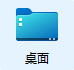

# fastLink

一个智能且方便的符号链接创建工具，支持regex，以及一些基于符号链接实现的程序(`Desks`系列)

For Windows (at present)

项目为一个workspace，包含多个crate，每个crate内都有各自的README.md

### 权限

如果你处于Windows的开发者模式，则不需要`sudo`或者`管理员权限`  
Do not need `sudo` or `administrator` if Developer Mode enabled.  

# Desks 系列

**Only for Windows 11.**

包含两个命令行工具与一个托盘程序。

该系列基于fastLink，需要一些*权限*来创建符号链接，建议打开*Windows 开发者模式*，或者每次执行都给予管理员权限。

### 有什么用？

在Windows平台下修改Desktop库目标文件夹, 使用符号链接指向已有的文件夹, 动态修改桌面内容。

> [!WARNING]
>
> 声明：
>     注意，不保证安全无bug，如果遇到问题，请积极提交issue。
>     不支持多用户，初始化后请勿手动修改`桌面库`的位置、名称等，这些操作都有可能让你丢失你的桌面库。
>
> 如果有任何修改桌面库的需求，请使用`desks reset -k`来重置，修改之后再初始化，以防发生棘手的情况。

### 什么是桌面库？

默认情况，就是你的桌面，就是`C:\Users\%username%\Desktop`这个文件夹，就是这个：

### 怎么用？

下载desks.exe与desks-tray.exe，然后参考[desks-tray usage](./desks-tray/README.md#usage)

### 特性

- 保持桌面图标布局
  - [x] 手动保存、恢复桌面布局
  - [ ] 动态适应分辨率
  - [ ] 多显示器
- 自定义图标

### 使用场景示例

- 桌面文件/文件夹众多，想要工作、休闲分离
- 有一些文件/文件夹想放桌面，但是平时又不想让其他人看见
- 换一个桌面，即刻切换你跟电脑的状态与心情

# 仓库模块介绍

## fastlink-core

项目核心，包含`LinkTask`以及相关结构体定义，mklink以及相关函数定义，日志系统。  

先构建`LinkTaskArgs`（使用builder或from(Args)），经过`LinkTaskPre`预处理，得到`LinkTask`，
对`LinkTask`实例使用mklinks等方法可以创建、检查、删除符号链接。

## fastlink-cli
包含两个二进制: `fastlink`与`fastlink-slim`

用于在命令行创建符号链接，具体用法可以参考示例或`--help`

`fastlink-slim`不包含re支持与save_log  

两个二进制都可以使用可选参数`-c`检查路径，`--rm`删除已存在的符号链接

[fastlink-help](./fastlink-cli/README.md#fastlink-help)

## desks-core

**desks**系列(desks, desku, desks-tray)的核心，主要定义了一些处理方法以及一个共享的状态数据文件。

## desks-cli
desks-core的一些封装，包含两个二进制`desks`与`desku`，均为命令行工具。

`desks` 目前是desks系列的核心程序，包含初始化、设置桌面、添加常用路径、重置等，但不包括桌面布局管理等功能。

`desku` 只能通过以设置的常用路径来设置桌面，等效`desks u some_name`（就是为了省2个字）（更推荐使用`desks-tray`）

[desks-help](./desks-cli/README.md#desks-help)

## desks-tray
desks系列的托盘程序，主要用于日常方便切换桌面，同时包含桌面布局保存、恢复功能。

[desks-tray details](./desks-tray/README.md)

## desktop-layout

实现保存、恢复桌面图标布局以及相关功能。

**读取当前布局信息暂时使用python实现，再打包到exe嵌入到rust程序**（也导致最终exe增长约8mb），欢迎大佬贡献代码或提出rust解决方案。

由于GitHub Action Workflow中自动打包python得到的二进制有点问题，仓库直接上传了本地打包的exe

# 开发/贡献

代码内有一些todo，以及当前迫切需要解决的完全使用rust实现`desktop-layout`模块。

编译等目录可以参考项目的workflow配置文件，被注释部分为打包python二进制

# Feedback

如果发生了一些预期之外的问题，提个issue，记得贴上带`--debug`参数时的日志。

If something not expected happened, open an issue and paste the log with `--debug` argument.  

如果是`desks`系列程序(desks, desku, desks-tray)，还需要使用`desks state`， 并使用`fastlink -c $initial_path$`与`fastlink -c $initial_path_temp$`
（手动替换$initial_path$与$initial_path_temp$），将返回信息一并提交到issue内

注：若无法使用`desks state`, 请使用全局搜索工具如`everything`搜索路径`fastlink\desktop_setter\state.json`获取程序状态, 

对于desks-tray, 日志在`fastlink\desktop_setter\log`中保存。