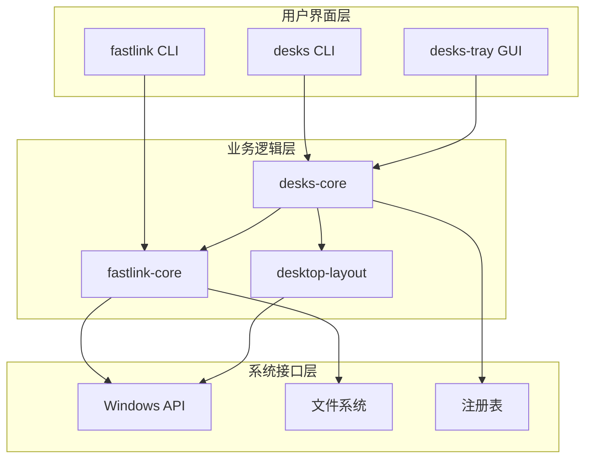
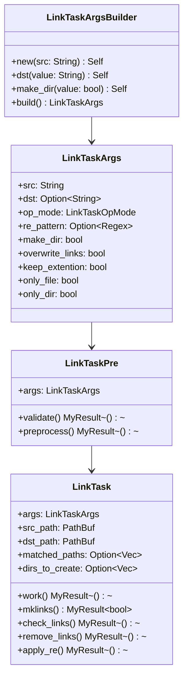
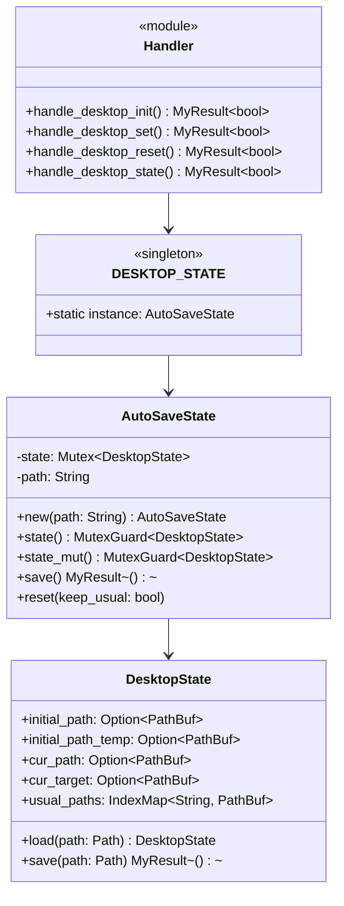
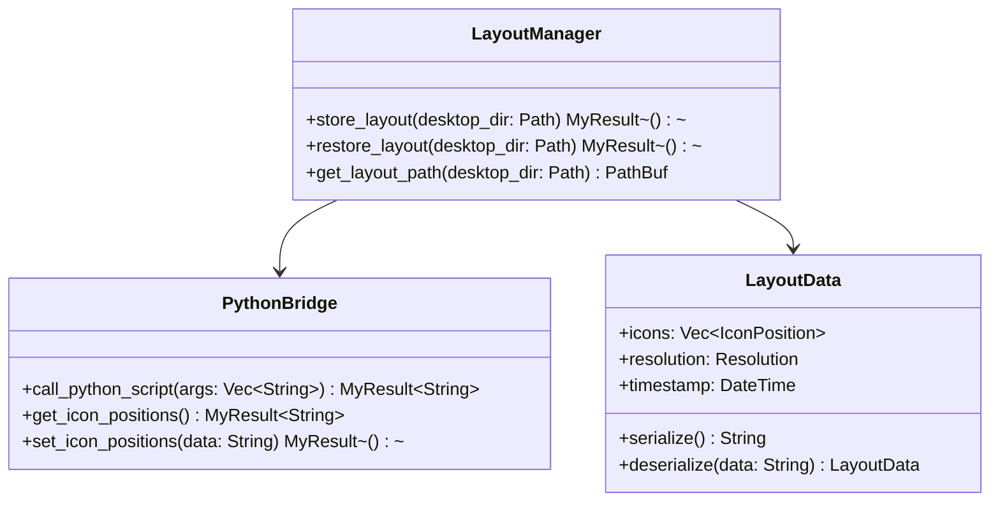
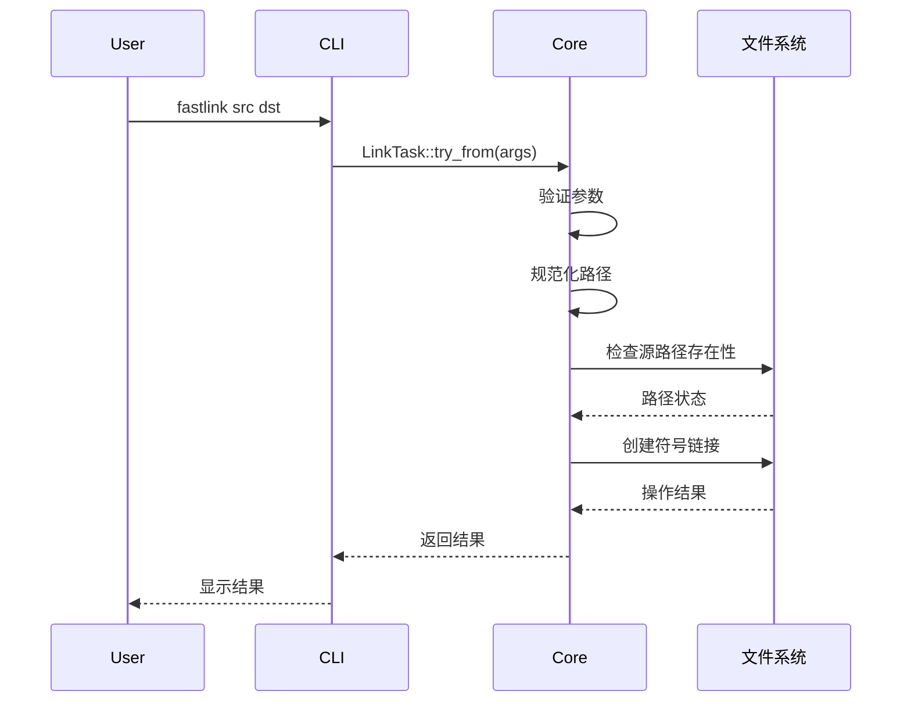
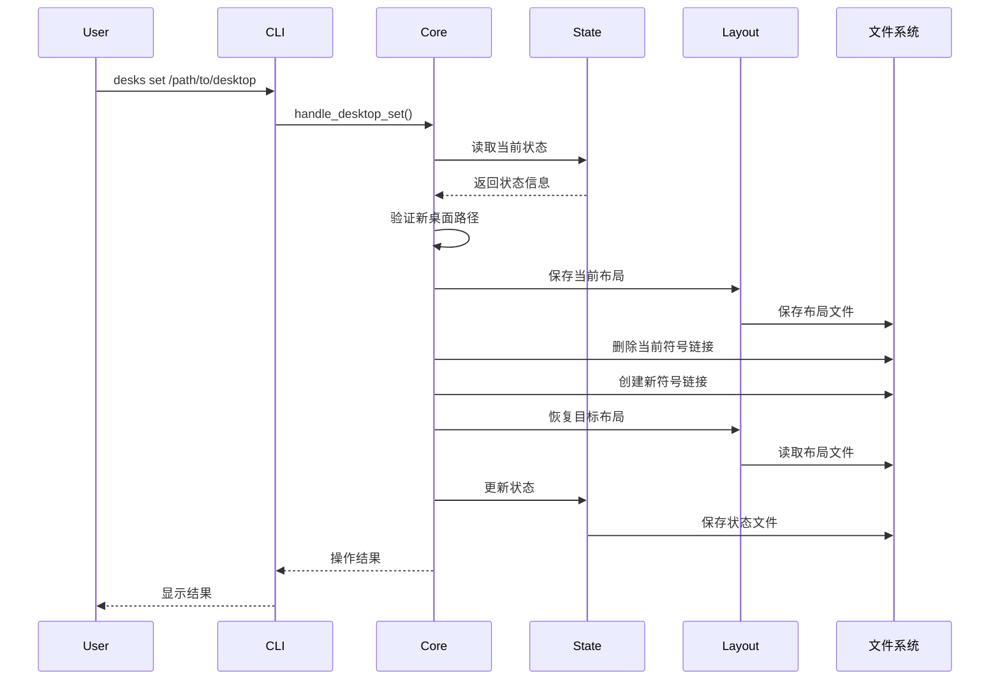
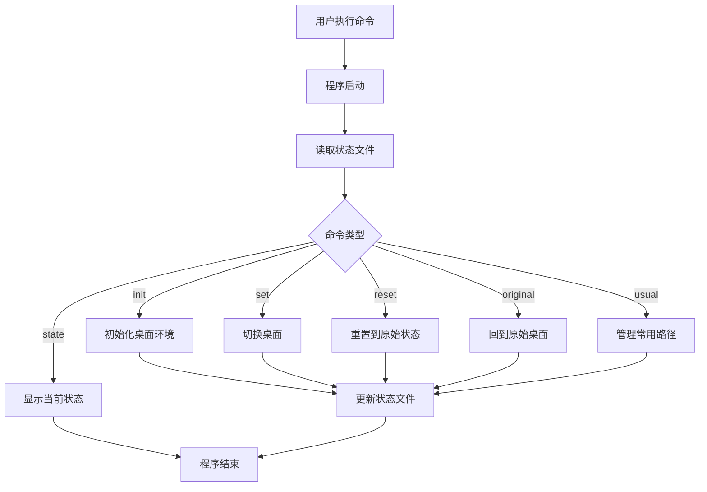
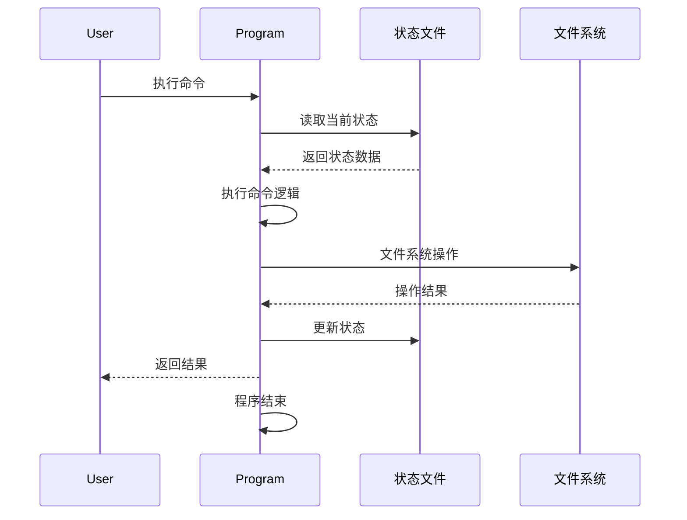

# fastLink 架构设计文档

## 1. 系统架构概览

### 1.1 整体架构

fastLink 采用分层架构设计，从底层的系统接口到上层的用户界面，提供了完整的符号链接管理和桌面环境切换解决方案。



### 1.2 架构层次说明

#### 用户界面层

- **fastlink CLI**：符号链接管理的命令行工具
- **desks CLI**：桌面管理的命令行工具
- **desks-tray GUI**：系统托盘图形界面

#### 业务逻辑层

- **fastlink-core**：符号链接操作的核心库
- **desks-core**：桌面管理的核心业务逻辑
- **desktop-layout**：桌面布局管理功能

#### 系统接口层

- **Windows API**：系统级API调用
- **文件系统**：文件和目录操作
- **注册表**：系统配置访问

## 2. 模块架构设计

### 2.1 fastlink-core 核心模块



#### 核心组件说明

**LinkTaskArgs**：

- 任务参数配置结构体
- 支持 Builder 模式构建
- 包含所有操作选项和模式设置

**LinkTaskPre**：

- 任务预处理阶段
- 负责参数验证和路径规范化
- 为实际执行做准备

**LinkTask**：

- 核心执行单元
- 封装完整的符号链接操作流程
- 支持批量操作和错误处理

### 2.2 desks-core 桌面管理模块



#### 状态管理设计

**DesktopState**：

- 桌面状态数据结构
- 支持序列化和反序列化
- 包含所有桌面相关的路径信息

**AutoSaveState**：

- 自动保存的状态管理器
- 线程安全的状态访问
- 自动持久化到配置文件

**DESKTOP_STATE**：

- 全局单例状态实例
- 延迟初始化
- 程序生命周期内保持状态

### 2.3 desktop-layout 布局管理模块



## 3. 数据流设计

### 3.1 符号链接创建流程



### 3.2 桌面切换流程



### 3.3 状态管理流程

desks系列程序采用独立命令执行模式，每个命令都是完整的程序生命周期。

#### 3.3.1 命令执行模式



#### 3.3.2 状态文件管理

每个命令执行时的状态管理流程：



#### 3.3.3 各命令的状态影响

**desks init（初始化）**：

- 相当于"安装"桌面管理功能
- 备份原始桌面到 `Desktop_temp`
- 设置 `initial_path` 和 `initial_path_temp`
- 状态：未初始化 → 已初始化

**desks set <path>（设置桌面）**：

- 保存当前桌面布局（如果启用）
- 删除现有符号链接
- 创建指向新目录的符号链接
- 恢复目标桌面布局（如果存在）
- 更新 `cur_path` 和 `cur_target`

**desks original（回到原始）**：

- 删除符号链接
- 恢复原始桌面目录
- 临时操作，不改变主要状态

**desks reset（重置）**：

- 相当于"卸载"桌面管理功能
- 删除符号链接
- 恢复原始桌面
- 清理临时文件
- 状态：已初始化 → 未初始化

**desks state（查看状态）**：

- 只读操作，不修改任何状态
- 显示当前配置信息

**desks usual（管理常用路径）**：

- 添加/删除常用桌面路径
- 更新 `usual_paths` 配置

## 4. 配置和数据管理

### 4.1 配置文件结构

**主配置文件**：`%APPDATA%\fastlink\desktop_setter\state.json`

```json
{
  "initial_path": "C:\\Users\\username\\Desktop",
  "initial_path_temp": "C:\\Users\\username\\Desktop_temp",
  "cur_path": "C:\\Users\\username\\Desktop",
  "cur_target": "D:\\MyDesktops\\work",
  "usual_paths": {
    "work": "D:\\MyDesktops\\work",
    "personal": "D:\\MyDesktops\\personal",
    "clean": "D:\\MyDesktops\\clean"
  }
}
```

**布局文件**：`%APPDATA%\fastlink\desktop_setter\layouts\{desktop_hash}.dsv`

### 4.2 日志管理

**日志目录**：`%APPDATA%\fastlink\desktop_setter\log\`

**日志级别**：

- ERROR：错误信息
- WARN：警告信息
- INFO：一般信息
- DEBUG：调试信息

**日志轮转**：

- 按日期轮转
- 保留最近30天的日志
- 单个日志文件最大10MB

## 5. 安全性设计

### 5.1 权限管理

**符号链接权限**：

- 开发者模式：无需提升权限
- 普通模式：需要管理员权限
- 权限检查：运行时验证

**文件系统权限**：

- 只操作用户有权限的目录
- 避免系统关键目录
- 路径验证和清理

### 5.2 数据保护

**状态文件保护**：

- 原子性写入
- 备份机制
- 完整性校验

**操作安全**：

- 操作前验证
- 失败回滚
- 详细日志记录

## 6. 性能优化

### 6.1 内存管理

- 延迟加载配置
- 及时释放资源
- 避免内存泄漏

### 6.2 I/O 优化

- 批量文件操作
- 异步I/O（规划中）
- 缓存机制

### 6.3 启动优化

- 最小化启动依赖
- 延迟初始化
- 快速失败机制

## 7. 扩展性设计

### 7.1 插件架构（规划中）

- 插件接口定义
- 动态加载机制
- 插件生命周期管理

### 7.2 多平台支持（规划中）

- 平台抽象层
- 条件编译
- 平台特定实现

### 7.3 API 接口（规划中）

- REST API 服务
- 进程间通信
- 第三方集成接口
