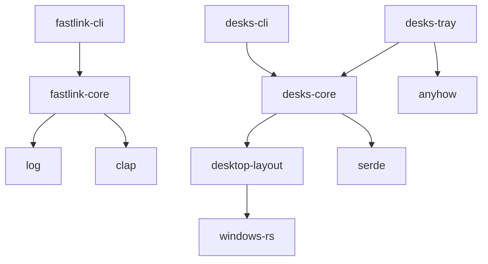

# fastLink 开发者指南

## 目录

1. [项目概述](#项目概述)
2. [开发环境设置](#开发环境设置)
3. [项目架构深入](#项目架构深入)
4. [代码组织和模块设计](#代码组织和模块设计)

## 项目概述

### 技术栈

- **语言**: Rust 2021 Edition
- **构建工具**: Cargo
- **CLI框架**: clap v4
- **异步运行时**: tokio
- **日志**: log, env_logger
- **错误处理**: 自定义 MyError 系统
- **序列化**: serde
- **系统托盘**: tray-icon
- **Windows API**: windows-rs

### 核心设计理念

1. **模块化设计**: 每个功能模块独立开发和测试
2. **零拷贝优化**: 尽可能减少不必要的内存分配
3. **错误透明**: 提供清晰的错误信息和恢复机制
4. **平台特化**: 针对Windows平台进行深度优化
5. **用户友好**: 提供直观的CLI和GUI界面

## 开发环境设置

### 系统要求

- Windows 10/11 (x64)
- Rust 1.70+ (推荐使用最新稳定版)
- Visual Studio Build Tools 或 Visual Studio Community
- Git

### 环境配置

```bash
# 1. 安装 Rust
curl --proto '=https' --tlsv1.2 -sSf https://sh.rustup.rs | sh

# 2. 配置工具链
rustup default stable
rustup component add clippy rustfmt

# 3. 克隆项目
git clone https://github.com/your-org/fastLink.git
cd fastLink

# 4. 构建项目
cargo build

# 5. 运行测试
cargo test
```

### 开发工具推荐

- **IDE**: VS Code + rust-analyzer
- **调试**: VS Code Debugger, GDB
- **性能分析**: cargo-flamegraph, perf
- **代码质量**: clippy, rustfmt
- **文档**: cargo-doc

## 项目架构深入

### Workspace 结构

```txt
fastLink/
├── fastlink-core/     # 核心符号链接功能
├── fastlink-cli/      # 命令行工具
├── desks-core/        # 桌面状态管理核心
├── desks-cli/         # 桌面管理CLI
├── desks-tray/        # 系统托盘应用
├── desktop-layout/    # 桌面图标布局管理
└── docs/             # 项目文档
```

### 依赖关系图



### 3. 移除错误的异步功能描述

需要从以下文档中移除关于 tokio 和异步支持的错误描述：
- <mcfile name="fastlink-core.md" path="d:\Codes\rust\fastLink\docs\fastlink-core.md"></mcfile>
- <mcfile name="desks-core.md" path="d:\Codes\rust\fastLink\docs\desks-core.md"></mcfile>

## 🚀 未来发展规划

### 阶段一：技术债务清理（1-2个月）

#### 1.1 依赖管理优化

**目标**：统一依赖版本，清理无用依赖

```toml:d%3A%5CCodes%5Crust%5CfastLink%5CCargo.toml
[workspace]
resolver = "2"
members = [
    "fastlink-core",
    "fastlink-cli",
    "desks-core",
    "desks-cli",
    "desks-tray",
    "desktop-layout",
]

[workspace.dependencies]
# 统一版本管理
clap = { version = "4.5.40", features = ["derive"] }
log = "0.4.27"
serde = { version = "1.0.219", features = ["derive"] }
serde_json = "1.0.140"
windows = { version = "0.61.3" }
chrono = "0.4.41"
dirs = "6.0.0"
regex = { version = "1.11.1", default-features = false, features = ["std", "perf", "unicode"] }

# 未来规划的依赖
tokio = { version = "1.0", features = ["full"] }
tracing = "0.1"
tracing-subscriber = { version = "0.3", features = ["env-filter"] }
thiserror = "1.0"
anyhow = "1.0"
```

#### 1.2 清理 fastlink-core 依赖

```toml:d%3A%5CCodes%5Crust%5CfastLink%5Cfastlink-core%5CCargo.toml
[dependencies]
chrono = { workspace = true }
# 移除 clap 依赖
dunce = "1.0.5"
env_logger = { version = "0.11.8" }
lazy_static = "1.5.0"
log = { workspace = true }
path-clean = "1.0.1"
strip-ansi-escapes = { version = "0.2.1", optional = true }
walkdir = { version = "2.5.0", optional = true }

[dependencies.regex]
workspace = true
optional = true
```

### 阶段二：日志系统升级（2-3个月）

#### 2.1 引入 tracing 框架

**迁移策略**：
1. 保持向后兼容，同时支持 log 和 tracing
2. 逐步迁移各模块到 tracing
3. 最终移除 log 依赖

```rust:d%3A%5CCodes%5Crust%5CfastLink%5Cfastlink-core%5Csrc%5Cutils%5Clogs.rs
use tracing::{info, warn, error, debug};
use tracing_subscriber::{
    layer::SubscriberExt,
    util::SubscriberInitExt,
    EnvFilter,
    fmt,
};

pub struct TracingIniter {
    quiet: bool,
    debug: bool,
    save_log: Option<String>,
}

impl TracingIniter {
    pub fn new(quiet: bool, debug: bool, save_log: Option<String>) -> Self {
        Self { quiet, debug, save_log }
    }

    pub fn init(self) {
        let env_filter = if self.debug {
            EnvFilter::new("debug")
        } else if self.quiet {
            EnvFilter::new("error")
        } else {
            EnvFilter::new("info")
        };

        let fmt_layer = fmt::layer()
            .with_target(false)
            .with_thread_ids(true)
            .with_file(self.debug)
            .with_line_number(self.debug);

        let subscriber = tracing_subscriber::registry()
            .with(env_filter)
            .with(fmt_layer);

        if let Some(log_path) = self.save_log {
            // 添加文件输出层
            let file_layer = fmt::layer()
                .with_writer(std::fs::File::create(log_path).expect("创建日志文件失败"))
                .with_ansi(false);
            
            subscriber.with(file_layer).init();
        } else {
            subscriber.init();
        }
    }
}
```

#### 2.2 结构化日志支持

```rust:d%3A%5CCodes%5Crust%5CfastLink%5Cfastlink-core%5Csrc%5Ctypes%5Clink_task.rs
use tracing::{info, warn, error, instrument};

impl LinkTask {
    #[instrument(skip(self), fields(src = %self.args.src, dst = ?self.args.dst))]
    pub async fn work_async(&self) -> MyResult<()> {
        info!("开始执行链接任务");
        
        match self.args.op_mode {
            LinkTaskOpMode::Make => {
                info!("创建符号链接");
                self.mklinks_async().await
            },
            LinkTaskOpMode::Check => {
                info!("检查符号链接");
                self.check_links_async().await
            },
            LinkTaskOpMode::Remove => {
                info!("删除符号链接");
                self.remove_links_async().await
            },
        }
    }
}
```

### 阶段三：异步支持实现（3-4个月）

#### 3.1 核心 API 异步化

```rust:d%3A%5CCodes%5Crust%5CfastLink%5Cfastlink-core%5Csrc%5Ctypes%5Clink_task.rs
use tokio::fs;
use tokio::task;

#[async_trait::async_trait]
pub trait AsyncLinkOps {
    async fn create_symlink(&self, src: &Path, dst: &Path) -> MyResult<()>;
    async fn remove_symlink(&self, path: &Path) -> MyResult<()>;
    async fn check_symlink(&self, path: &Path) -> MyResult<bool>;
}

impl LinkTask {
    pub async fn mklinks_async(&self) -> MyResult<()> {
        let tasks = self.build_link_tasks_async().await?;
        
        // 并发执行多个链接操作
        let results = futures::future::join_all(
            tasks.into_iter().map(|task| self.create_single_link_async(task))
        ).await;
        
        // 处理结果
        for result in results {
            result?;
        }
        
        Ok(())
    }
    
    async fn create_single_link_async(&self, task: SingleLinkTask) -> MyResult<()> {
        // 异步文件系统操作
        let src_metadata = fs::metadata(&task.src).await
            .map_err(|e| MyError::new(ErrorCode::FileNotExist, e.to_string()))?;
        
        // 创建符号链接
        if src_metadata.is_dir() {
            #[cfg(windows)]
            {
                task::spawn_blocking(move || {
                    std::os::windows::fs::symlink_dir(&task.src, &task.dst)
                }).await??
            }
        } else {
            #[cfg(windows)]
            {
                task::spawn_blocking(move || {
                    std::os::windows::fs::symlink_file(&task.src, &task.dst)
                }).await??
            }
        }
        
        Ok(())
    }
}
```

#### 3.2 桌面状态管理异步化

```rust:d%3A%5CCodes%5Crust%5CfastLink%5Cdesks-core%5Csrc%5Cstate.rs
use tokio::sync::RwLock;
use tokio::fs;

pub struct AsyncDesktopState {
    state: Arc<RwLock<DesktopState>>,
    path: PathBuf,
}

impl AsyncDesktopState {
    pub async fn load(path: impl AsRef<Path>) -> MyResult<Self> {
        let path = path.as_ref().to_path_buf();
        let state = if path.exists() {
            let data = fs::read_to_string(&path).await?;
            if data.is_empty() {
                DesktopState::default()
            } else {
                serde_json::from_str(&data)?
            }
        } else {
            DesktopState::default()
        };
        
        Ok(Self {
            state: Arc::new(RwLock::new(state)),
            path,
        })
    }
    
    pub async fn save(&self) -> MyResult<()> {
        let state = self.state.read().await;
        let data = serde_json::to_string_pretty(&*state)?;
        fs::write(&self.path, data).await?;
        Ok(())
    }
}
```

### 阶段四：错误处理系统优化（4-5个月）

#### 4.1 引入 thiserror 和 anyhow

```rust:d%3A%5CCodes%5Crust%5CfastLink%5Cfastlink-core%5Csrc%5Ctypes%5Cerr.rs
use thiserror::Error;
use anyhow::{Context, Result as AnyhowResult};

#[derive(Error, Debug)]
pub enum FastLinkError {
    #[error("文件不存在: {path}")]
    FileNotExist { path: String },
    
    #[error("权限被拒绝: {operation}")]
    PermissionDenied { operation: String },
    
    #[error("I/O 错误")]
    Io(#[from] std::io::Error),
    
    #[error("序列化错误")]
    Serialization(#[from] serde_json::Error),
    
    #[error("Windows API 错误: {0}")]
    WindowsApi(#[from] windows::core::Error),
    
    #[error("正则表达式错误")]
    Regex(#[from] regex::Error),
    
    #[error("符号链接操作失败: {operation}")]
    SymlinkOperation { operation: String },
    
    #[error("桌面状态错误: {message}")]
    DesktopState { message: String },
}

pub type FastLinkResult<T> = Result<T, FastLinkError>;

// 为了向后兼容，保留 MyResult 别名
pub type MyResult<T> = FastLinkResult<T>;
pub type MyError = FastLinkError;

// 扩展 anyhow::Result 以提供更好的错误上下文
pub trait FastLinkContext<T> {
    fn with_context_fl<F>(self, f: F) -> AnyhowResult<T>
    where
        F: FnOnce() -> String;
}

impl<T, E> FastLinkContext<T> for Result<T, E>
where
    E: std::error::Error + Send + Sync + 'static,
{
    fn with_context_fl<F>(self, f: F) -> AnyhowResult<T>
    where
        F: FnOnce() -> String,
    {
        self.with_context(f)
    }
}
```

#### 4.2 事务性操作支持

```rust:d%3A%5CCodes%5Crust%5CfastLink%5Cfastlink-core%5Csrc%5Ctransaction.rs
use anyhow::Result;

pub struct LinkTransaction {
    operations: Vec<LinkOperation>,
    completed: Vec<CompletedOperation>,
}

#[derive(Debug)]
pub enum LinkOperation {
    CreateLink { src: PathBuf, dst: PathBuf },
    RemoveLink { path: PathBuf },
    CreateDir { path: PathBuf },
}

#[derive(Debug)]
pub enum CompletedOperation {
    CreatedLink { dst: PathBuf },
    RemovedLink { path: PathBuf, was_link: bool },
    CreatedDir { path: PathBuf },
}

impl LinkTransaction {
    pub fn new() -> Self {
        Self {
            operations: Vec::new(),
            completed: Vec::new(),
        }
    }
    
    pub fn add_operation(&mut self, op: LinkOperation) {
        self.operations.push(op);
    }
    
    pub async fn commit(mut self) -> Result<()> {
        for operation in self.operations {
            match operation {
                LinkOperation::CreateLink { src, dst } => {
                    self.create_link_with_rollback(&src, &dst).await
                        .with_context(|| format!("创建链接失败: {} -> {}", src.display(), dst.display()))?;
                },
                LinkOperation::RemoveLink { path } => {
                    self.remove_link_with_rollback(&path).await
                        .with_context(|| format!("删除链接失败: {}", path.display()))?;
                },
                LinkOperation::CreateDir { path } => {
                    self.create_dir_with_rollback(&path).await
                        .with_context(|| format!("创建目录失败: {}", path.display()))?;
                },
            }
        }
        Ok(())
    }
    
    pub async fn rollback(self) -> Result<()> {
        // 按相反顺序回滚已完成的操作
        for completed in self.completed.into_iter().rev() {
            match completed {
                CompletedOperation::CreatedLink { dst } => {
                    if dst.exists() {
                        tokio::fs::remove_file(&dst).await
                            .with_context(|| format!("回滚时删除链接失败: {}", dst.display()))?;
                    }
                },
                CompletedOperation::RemovedLink { path, was_link } => {
                    // 注意：删除的链接无法完全恢复，只能记录
                    tracing::warn!("无法恢复已删除的链接: {}", path.display());
                },
                CompletedOperation::CreatedDir { path } => {
                    if path.exists() && path.is_dir() {
                        tokio::fs::remove_dir(&path).await
                            .with_context(|| format!("回滚时删除目录失败: {}", path.display()))?;
                    }
                },
            }
        }
        Ok(())
    }
}
```

### 错误处理最佳实践

```rust
// 1. 创建错误
fn validate_path(path: &Path) -> MyResult<()> {
    if !path.exists() {
        return Err(MyError::new(
            ErrorCode::FileNotExist,
            format!("{}", path.display()),
        ));
    }
    Ok(())
}

// 2. 错误处理和日志记录
fn handle_result<T: std::fmt::Debug>(res: MyResult<T>) -> Option<T> {
    if let Err(e) = res {
        e.log();  // 记录错误日志
        None
    } else {
        let ok_value = res.unwrap();
        log::debug!("{:?}", ok_value);
        Some(ok_value)
    }
}

// 3. 错误码匹配处理
fn handle_mklink_error(res: MyResult<()>, path: &Path) -> MyResult<()> {
    if let Err(mut e) = res {
        match e.code {
            ErrorCode::FileNotExist => Ok(()),
            ErrorCode::TargetExistsAndNotLink => {
                if path.is_dir() {
                    Ok(())
                } else {
                    e.msg = format!("目标存在但不是目录: {}", e.msg);
                    Err(e)
                }
            }
            ErrorCode::BrokenSymlink => {
                e.warn();  // 记录警告
                Ok(())     // 继续处理
            }
            _ => Err(e),
        }
    } else {
        Ok(())
    }
}

// 4. I/O 错误转换
fn read_file_safe(path: &Path) -> MyResult<String> {
    match std::fs::read_to_string(path) {
        Ok(content) => Ok(content),
        Err(e) if e.kind() == std::io::ErrorKind::NotFound => {
            Err(MyError::new(
                ErrorCode::FileNotExist,
                format!("{}", path.display()),
            ))
        }
        Err(e) if e.kind() == std::io::ErrorKind::PermissionDenied => {
            Err(MyError::new(
                ErrorCode::PermissionDenied,
                format!("权限不足: {}", path.display()),
            ))
        }
        Err(e) => Err(MyError::new(
            ErrorCode::IoError,
            format!("IO错误: {} - {}", e, path.display()),
        )),
    }
}
- **错误处理**: 自定义错误类型 (ErrorCode + MyError)
- **异步运行时**: 仅在需要时使用 (主要是同步操作)
- **系统托盘**: tray-icon, tao
- **文件对话框**: rfd (可选)
