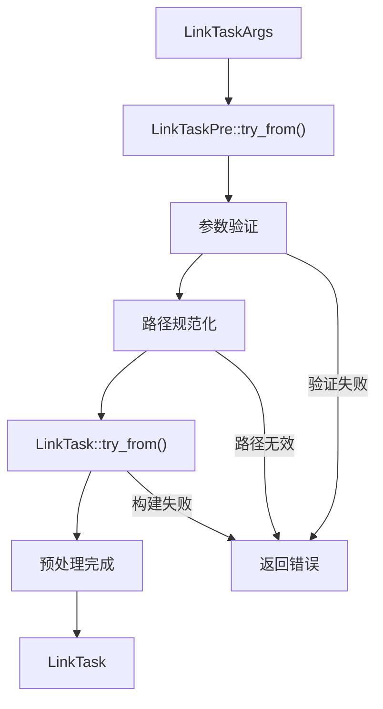

# fastlink-core 模块技术文档

## 1. 模块概述

`fastlink-core` 是 fastLink 项目的核心库，提供符号链接管理的基础功能和通用工具。该模块设计为平台无关的核心逻辑层，为上层应用提供稳定的API接口。

### 1.1 核心职责

- **符号链接操作**：创建、检查、删除符号链接
- **路径管理**：路径验证、规范化、批量处理
- **正则表达式支持**：基于模式的文件匹配和处理
- **错误处理**：统一的错误类型和处理机制
- **工具函数**：通用的文件系统操作工具

### 1.2 模块结构

```txt
fastlink-core/
├── src/
│   ├── lib.rs          # 模块入口和全局配置
│   ├── types/          # 核心数据类型定义
│   │   ├── mod.rs      # 类型模块导出
│   │   ├── err.rs      # 错误类型定义
│   │   ├── link_task.rs        # 链接任务核心逻辑
│   │   ├── link_task_args.rs   # 任务参数定义
│   │   └── link_task_pre.rs    # 任务预处理
│   └── utils/          # 工具函数
│       ├── mod.rs      # 工具模块导出
│       └── ...         # 各种工具函数
└── Cargo.toml          # 依赖配置
```

## 2. 核心类型设计

### 2.1 LinkTaskArgs - 任务参数

```rust
pub struct LinkTaskArgs {
    pub src: String,                    // 源路径
    pub dst: Option<String>,            // 目标路径（可选）
    pub op_mode: LinkTaskOpMode,        // 操作模式
    
    // 正则表达式相关（feature: fastlink-regex）
    #[cfg(feature = "fastlink-regex")]
    pub re_pattern: Option<Regex>,      // 正则表达式模式
    #[cfg(feature = "fastlink-regex")]
    pub re_max_depth: Option<u32>,      // 最大搜索深度
    #[cfg(feature = "fastlink-regex")]
    pub re_follow_links: bool,          // 是否跟随符号链接
    
    // 操作选项
    pub keep_extention: bool,           // 保持文件扩展名
    pub make_dir: bool,                 // 自动创建目录
    pub only_file: bool,                // 仅处理文件
    pub only_dir: bool,                 // 仅处理目录
    pub overwrite_links: bool,          // 覆盖现有链接
}
```

**设计特点**：

- 使用 Builder 模式构建，提供链式调用接口
- 支持条件编译，正则表达式功能可选
- 丰富的操作选项，满足不同使用场景

### 2.2 LinkTaskOpMode - 操作模式

```rust
#[derive(Debug, Clone, PartialEq)]
pub enum LinkTaskOpMode {
    Make,    // 创建符号链接
    Check,   // 检查符号链接状态
    Remove,  // 删除符号链接
}
```

### 2.3 LinkTask - 核心执行单元

```rust
pub struct LinkTask {
    pub args: LinkTaskArgs,
    pub src_path: PathBuf,              // 规范化的源路径
    pub dst_path: PathBuf,              // 规范化的目标路径
    
    #[cfg(feature = "fastlink-regex")]
    pub matched_paths: Option<Vec<PathBuf>>, // 正则匹配的路径
    
    pub dirs_to_create: Option<Vec<PathBuf>>, // 需要创建的目录
}
```

## 3. 核心功能实现

### 3.1 任务构建流程



### 3.2 符号链接操作

#### 3.2.1 创建链接 (Make)

```rust
pub fn mklinks(&self) -> MyResult<bool> {
    // 1. 检查源路径存在性
    if !self.src_path.exists() {
        return Err(MyError::PathNotFound(self.src_path.clone()));
    }
    
    // 2. 处理目标目录创建
    if self.args.make_dir {
        self.create_directories()?;
    }
    
    // 3. 处理现有链接
    if self.dst_path.exists() {
        if self.args.overwrite_links {
            self.remove_existing_link()?;
        } else {
            return Err(MyError::LinkAlreadyExists(self.dst_path.clone()));
        }
    }
    
    // 4. 创建符号链接
    self.create_symlink()?;
    
    Ok(true)
}
```

#### 3.2.2 检查链接 (Check)

```rust
pub fn check_links(&self) -> MyResult<()> {
    if self.dst_path.is_symlink() {
        let target = fs::read_link(&self.dst_path)?;
        if target == self.src_path {
            info!("符号链接正确: {} -> {}", 
                  self.dst_path.display(), 
                  self.src_path.display());
        } else {
            warn!("符号链接目标不匹配: {} -> {} (期望: {})", 
                  self.dst_path.display(), 
                  target.display(), 
                  self.src_path.display());
        }
    } else {
        warn!("路径不是符号链接: {}", self.dst_path.display());
    }
    Ok(())
}
```

#### 3.2.3 删除链接 (Remove)

```rust
pub fn remove_links(&self) -> MyResult<()> {
    if self.dst_path.is_symlink() {
        fs::remove_file(&self.dst_path)?;
        info!("已删除符号链接: {}", self.dst_path.display());
    } else if self.dst_path.exists() {
        warn!("路径存在但不是符号链接，跳过删除: {}", 
              self.dst_path.display());
    }
    Ok(())
}
```

### 3.3 正则表达式支持

当启用 `fastlink-regex` 特性时，支持基于正则表达式的批量操作：

```rust
#[cfg(feature = "fastlink-regex")]
pub fn apply_re(&mut self) -> MyResult<()> {
    let pattern = self.args.re_pattern.as_ref()
        .ok_or(MyError::RegexPatternMissing)?;
    
    let mut matched_paths = Vec::new();
    
    // 遍历源目录
    for entry in WalkDir::new(&self.src_path)
        .max_depth(self.args.re_max_depth.unwrap_or(u32::MAX) as usize)
        .follow_links(self.args.re_follow_links) {
        
        let entry = entry?;
        let path = entry.path();
        
        // 应用过滤条件
        if self.should_skip_path(path) {
            continue;
        }
        
        // 正则匹配
        if let Some(file_name) = path.file_name().and_then(|n| n.to_str()) {
            if pattern.is_match(file_name) {
                matched_paths.push(path.to_path_buf());
            }
        }
    }
    
    self.matched_paths = Some(matched_paths);
    Ok(())
}
```

## 4. 错误处理

### 4.1 错误类型定义

```rust
#[derive(Debug, Clone, Copy, PartialEq, Eq)]
pub enum ErrorCode {
    Unknown = -1,
    ParentNotExist = 1,
    FileNotExist = 4,
    InvalidInput = 2,
    IoError = 3,
    PermissionDenied = 5,
    // ... 其他错误码
}

#[derive(Debug)]
pub struct MyError {
    pub code: ErrorCode,
    pub msg: String,
}

pub type MyResult<T> = Result<T, MyError>;

impl MyError {
    pub fn new(code: ErrorCode, msg: String) -> Self {
        MyError { code, msg }
    }
    
    pub fn log(&self) { /* 日志记录 */ }
    pub fn warn(&self) { /* 警告日志 */ }
    pub fn debug(&self) { /* 调试日志 */ }
}
```

### 4.2 错误处理策略

- **快速失败**：参数验证阶段发现错误立即返回
- **详细日志**：记录错误发生的上下文信息
- **错误传播**：使用 `?` 操作符简化错误处理
- **用户友好**：提供清晰的错误消息

## 5. 性能优化

### 5.1 内存管理

- **延迟分配**：只在需要时分配 `matched_paths` 等大型数据结构
- **路径复用**：使用 `PathBuf` 避免重复的字符串分配
- **及时释放**：在操作完成后清理临时数据

### 5.2 I/O 优化

- **批量操作**：支持一次处理多个文件
- **路径缓存**：避免重复的路径解析
- **原子操作**：确保符号链接创建的原子性

## 6. 特性标志

### 6.1 fastlink-regex

启用正则表达式支持，增加以下功能：

- 基于模式的文件匹配
- 递归目录遍历
- 批量符号链接操作

### 6.2 save-log

启用日志保存功能：

- 日志文件自动轮转
- 可配置的日志级别
- 结构化日志输出

## 7. 使用示例

### 7.1 基本用法

```rust
use fastlink_core::types::{LinkTaskArgs, LinkTaskOpMode};

// 创建符号链接
let args = LinkTaskArgs::builder("C:\\\\source")
    .dst("C:\\\\target")
    .op_mode(LinkTaskOpMode::Make)
    .make_dir(true)
    .overwrite_links(true)
    .build();

let task = LinkTask::try_from(args)?;
task.work()?;
```

### 7.2 正则表达式批量操作

```rust
#[cfg(feature = "fastlink-regex")]
{
    use regex::Regex;
    
    let pattern = Regex::new(r"\\.txt$")?;
    let args = LinkTaskArgs::builder("C:\\\\documents")
        .dst("C:\\\\links")
        .op_mode(LinkTaskOpMode::Make)
        .re_pattern(Some(pattern))
        .re_max_depth(Some(3))
        .only_file(true)
        .build();
    
    let task = LinkTask::try_from(args)?;
    task.work()?;
}
```

## 8. 测试策略

### 8.1 单元测试

- **参数验证测试**：验证各种无效参数的处理
- **路径处理测试**：测试路径规范化和验证逻辑
- **错误处理测试**：确保错误情况的正确处理

### 8.2 集成测试

- **端到端测试**：完整的符号链接创建/删除流程
- **平台兼容性测试**：在不同Windows版本上的测试
- **性能测试**：大量文件的批量操作性能
